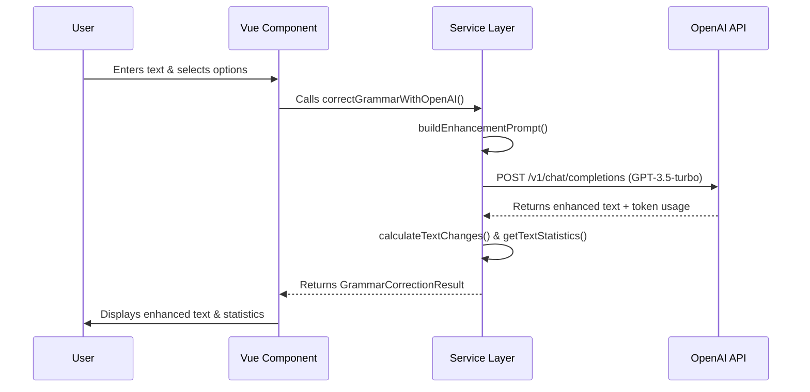

# Beautiful Grammar Technical Details

The **Beautiful Grammar** tool is a specialized text enhancement module within the DevTools suite. It leverages OpenAI's Large Language Models (LLM) to perform sophisticated linguistic transformations based on user-selectable intent.

## Architecture Overview

The module follows a clean separation of concerns between the presentation layer and the business logic:

- **UI Layer (`beautiful-grammer.vue`)**: Handles user interactions, state management (input/output texts, loading states), and provides a responsive, glassmorphic interface.
- **Service Layer (`beautiful-grammer.service.ts`)**: Contains pure programmatic logic for prompt construction, API communication, and linguistic analysis.
- **Integration Layer (`index.ts`)**: Registers the tool within the DevTools ecosystem.

## Data Flow

The following diagram illustrates the lifecycle of a text enhancement request:



## Technical Implementation

### 1. Dynamic Prompt Engineering

Instead of a static prompt, the service builds a context-aware instruction set based on user options:

```typescript
// Example of conditional prompt construction
if (options.professional) {
  enhancements.push('making the tone more professional and polished');
}
if (options.formal) {
  enhancements.push('converting to formal language and structure');
}
```

This ensures the LLM receives precise instructions, reducing "hallucinations" and maintaining the original meaning.

### 2. Readability Analysis

The tool implements a simplified version of the **Flesch Reading Ease** algorithm to measure text complexity.

**Mathematical Formula:**
`Score = 206.835 - (1.015 × ASL) - (84.6 × ASW)`

- **ASL**: Average Sentence Length (words / sentences)
- **ASW**: Average Syllables per Word (syllables / words)

The algorithm approximates syllable counts using vowel-cluster detection and heuristic rules (e.g., handling silent 'e').

### 3. Change Detection

To provide feedback on how much the AI modified the text, the tool performs a word-level diffing:

```typescript
export function calculateTextChanges(original: string, corrected: string): number {
  const originalWords = original.toLowerCase().split(/\s+/);
  const correctedWords = corrected.toLowerCase().split(/\s+/);
  // ... iteration and comparison ...
}
```

## Security & Persistence

- **API Key Security**: The OpenAI API key is never stored on a server. It is saved in the browser's `localStorage` and sent over an encrypted HTTPS connection directly to the official OpenAI endpoint.
- **Data Privacy**: Input text is processed in-memory and sent to OpenAI. No logs or history are maintained within the DevTools application beyond the current session's UI state.

## Resource Management

- **Token Limits**: Output is capped at 2000 tokens to prevent runaway costs.
- **Dynamic Max Tokens**: The tool uses `Math.min(2000, text.length * 2)` to optimize the response window relative to the input size.
- **Cost Estimation**: Provides a rough USD cost estimate based on characters-to-token heuristic (~4 chars/token).

---

_Last Updated: 2026-01-16_
_Document generated by Paige (Technical Writer Agent)_
